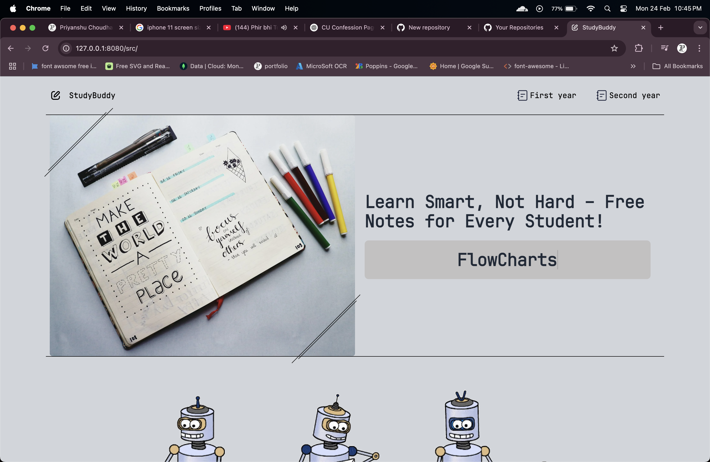
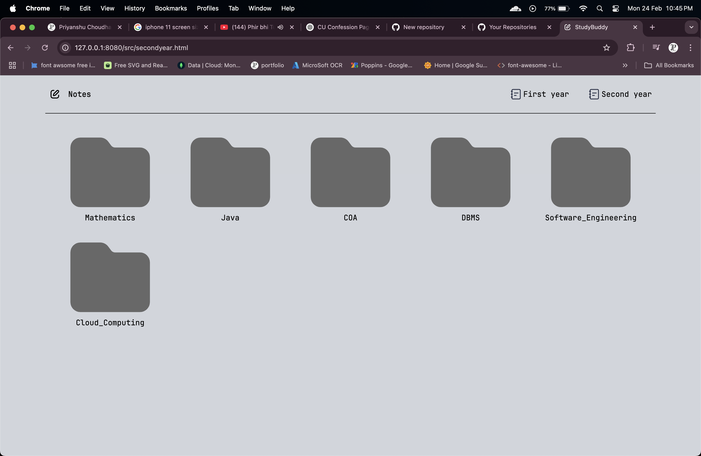

# StudyBuddy 📚

StudyBuddy is a free platform where students can access and share flowcharts, handwritten notes, text notes, and sample question papers. Designed to simplify study resources, it ensures students have everything they need in one place.

## 📸 Preview

## 🛠️ Tech Stack

- **Frontend:** HTML, Tailwind CSS, JavaScript
- **Hosting:** github

## ✨ Features

- 📄 **Flowcharts** – Access well-structured flowcharts for quick revisions.
- 📝 **Handwritten Notes** – Study from detailed handwritten notes by peers.
- 📚 **Text Notes** – Dive into topic-wise structured notes.
- 📖 **Sample Question Papers** – Prepare better with past exam papers.

# 🧠 Future Enhancements

- 📤 **Easy Uploads** – Share your own notes with the community.
- 💬 **Comments & Discussions** – Allow users to comment on notes and engage in topic discussions.
- ⭐ **Ratings & Reviews** – Let users rate and review notes to help others find quality content.
- 🔔 **Personalized Notifications** – Notify users about new uploads in their preferred subjects or streams.
- 🔍 **Advanced Search & Filters** – Implement filters based on subject, semester, exam type, and document type.
- 👥 **User Profiles** – Allow users to create profiles showcasing their uploaded notes and contributions.
- 🌙 **Dark Mode** – Provide a dark theme for comfortable reading at night.
- 📅 **Exam Scheduler & Reminders** – Help students organize their studies with exam date reminders and study plans.
- 📱 **Mobile App Integration** – Build a mobile app for easier access to notes on the go.
- 🛡️ **Content Moderation System** – Add AI-driven content moderation to filter inappropriate uploads.
- 🔖 **Bookmark & Save** – Allow users to bookmark or save notes for future reference.
- 📧 **Email Updates** – Send weekly or monthly digests featuring top-rated notes and new uploads.

---

**Developed with ❤️ by Priyanshu Choudhary**
